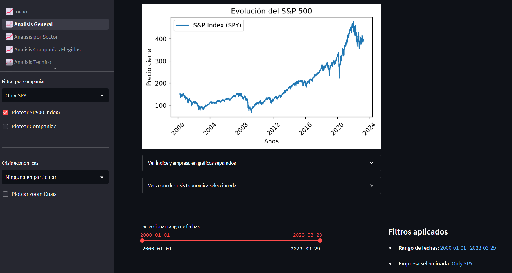
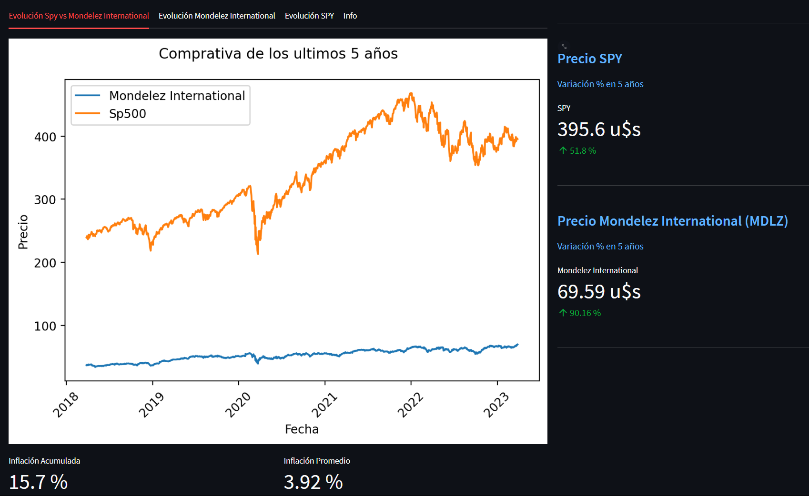
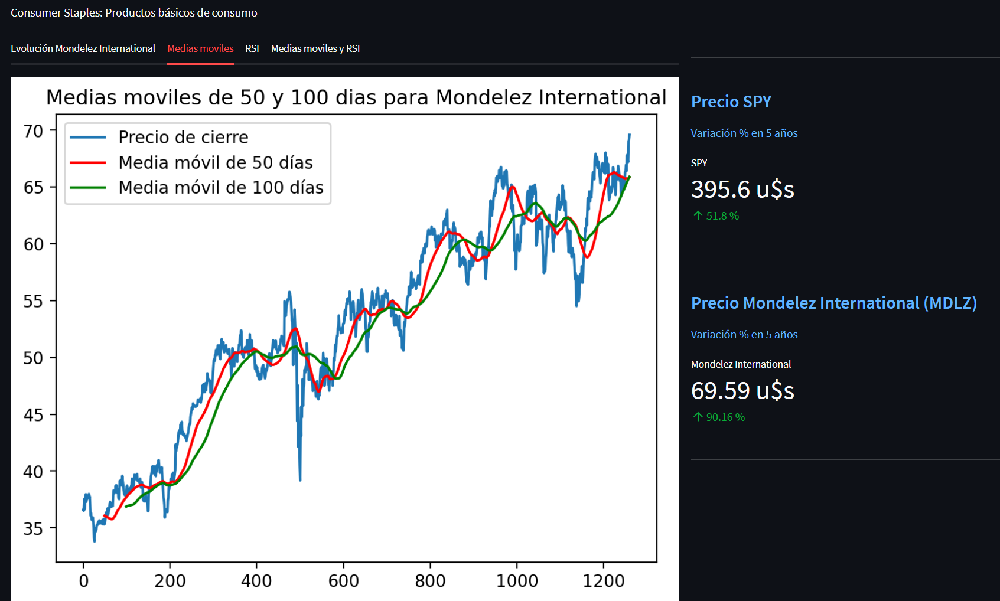
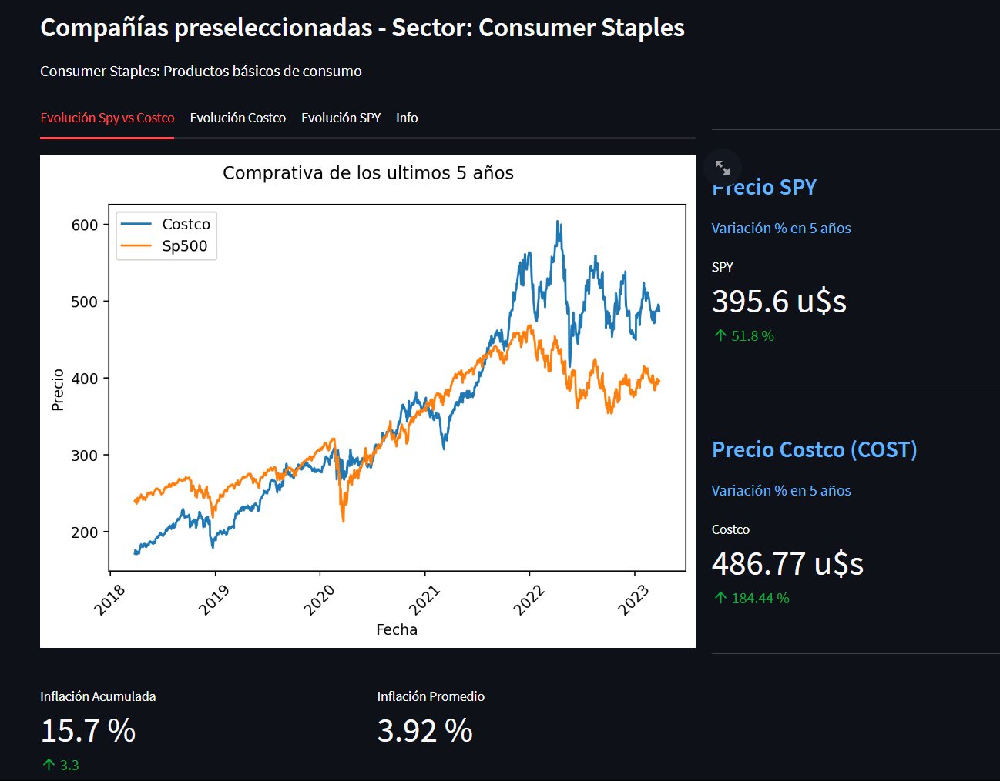

# **Proyecto de Noelia**  👻

### Deploy: 
https://phdnoe-pi-sp500-deploy-1--inicio-12m0fj.streamlit.app/

### Investigación de mercado e historia:
https://camiseta-blanca-poison.notion.site/Proyecto-Individual-N-2-5bacbbb1132a484c9091fa878e1eb2b5

# 📈 Factibilidad de cartera de inversión

---
## Empresa solicitante: Ficticia Conservadora (F.C)
---

### La empresa Ficticia Conservadora  ha solicitado una recomendación de cartera de inversión.

> * La empresa, una startup en crecimiento, desea invertir un capital excedente.
> * Acepta correr un riesgo mínimo a cambio de una tasa de retorno superior a la tasa de inflación
de Estados Unidos de los ultimos 5 años.
> * Su horizonte de inversión es a mediano/largo plazo, con una estancia mínima de 2 años.

## Contenido del informe:

### 📈 Análisis general
Dashboard interactivo mostrando evolución del índice S&P500 durante los últimos 23 años y de las compañías que lo componen.

- 🗓 Fitros de fechas
- 🫧 Indicadores gráficos de 3 crisis económicas:
    - 🌐 Burbuja dot com  
    - 🏠 Burbuja de hipotecas subprime
    - 🦠 Pandemia Covid-19  

### 📈 Análisis descriptivo y estadístico por sectores
Dashboard interactivo mostrando la evolución de los últimos 23 años de los distintos sectores
- 🗓  Filtro de fechas
- 📈 Datos de inflación anual y acumulada

### 📈 Análisis descriptivo y estadístico de las empresas seleccionadas
Dashboard interactivo mostrando la evolución de los últimos 5 años de las distintas empresas
- 📈 Ganancia porcentual por empresa
- 📈 Datos de inflación anual y acumulada
- 📈 Fundamentales de las empresas
    

### 📈 Análisis técnico de las compañias recomendadas
Dashboard interactivo mostrando los principales indicadores técnicos para analizar posibles zonas de compra.

Indicadores disponibles:
- 📉 Medias moviles de 50 y 100 días
- 📉 Índice de fuerza relativa (RSI)

### 📈 Conclusiones y recomendación final

#### **Conclusiones**

La recomendación final es armar una cartera equilibrada con aquellas acciones (de la lista de preseleccionadas) que cumplan con la condición de:

- Superar el porcentaje de inflación acumulado de los últimos 5 años
- Superar el porcentaje promedio del sp500 de los ultimos 5 años
- Porcentaje de ganancia Promedio > 50% (KPI)
- Capitalización de Mercado > 50B U$S  (KPI)
- PER (price to earnings ratio) > 15   (KPI)

Se recomienda esperar una señal clara de compra para las siguientes acciones:

- Costco (COST)
- General Mills (GIS)
- Hershey's (HSI)
- Coca-Cola (KO)
- Mondelez International (MDLZ)
- Monster Beverage (MNST)
- PepsiCo (PEP)
- Walmart (WMT)

Debido a que superan el margen de ganancia general del S&P500, y ademas han mostrado ser robustas frente a todas las crisis economicas.

#### En que invertir mientras no haya señal de compra?

- Bonos del tesoro
- Cauciones bursátiles

> Si tienen confianza en el mundo crypto, pueden esperar en un stacking flexible con alguna stablecoin tipo USDT o similar.

---